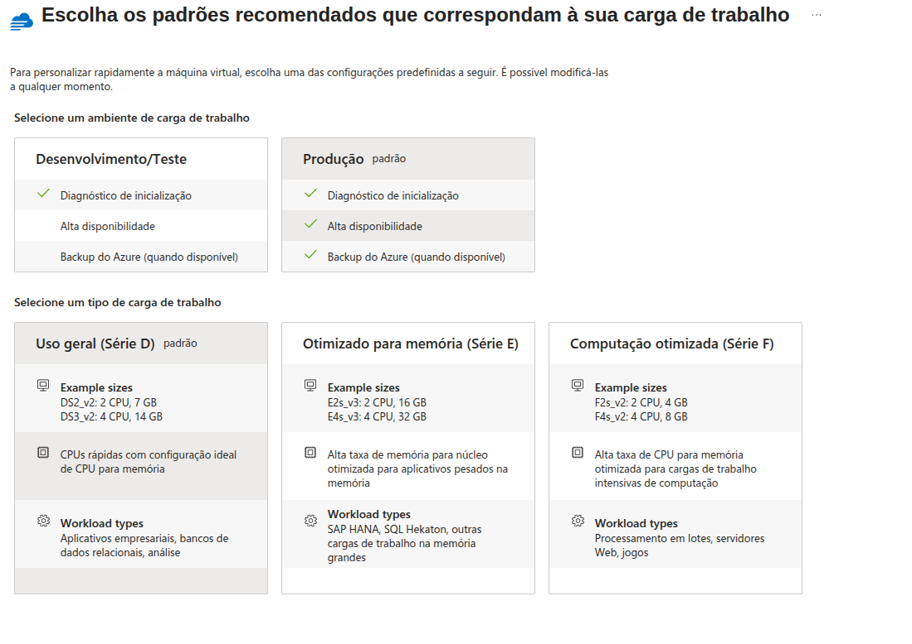
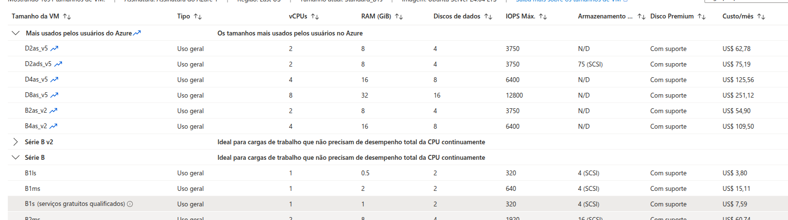
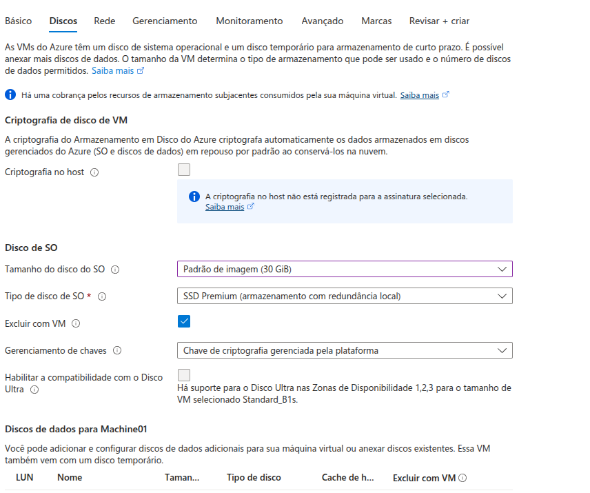

# Configurando Recursos e Dimensionamentos em Máquinas Virtuais na Azure
## Neste desafio Aprendi:
### - Como fazer Configuração de Escala -> 09:01 video
### - Como criar máquinas virtuais
### - Como configurar conjuntos de dimensionamento de máquinas virtuais
### - Como utilizar predefinições de máquinas virtuais
- Máquina virtual
- Conjuto de Dimensionamento de Máquinas Virtuais (VMSS)
- Predefinições
- Soluções híbridas, préconfiguradas e de alto volume

---

---
- Escolhendo maquina gratúita

---

---
