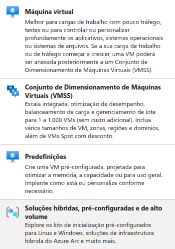

# Configurando Recursos e Dimensionamentos em Máquinas Virtuais na Azure
## Neste desafio Aprendi:
### - Como criar máquinas virtuais
- Máquina virtual
- Conjuto de Dimensionamento de Máquinas Virtuais (VMSS)
- Predefinições
- Soluções híbridas, préconfiguradas e de alto volume
