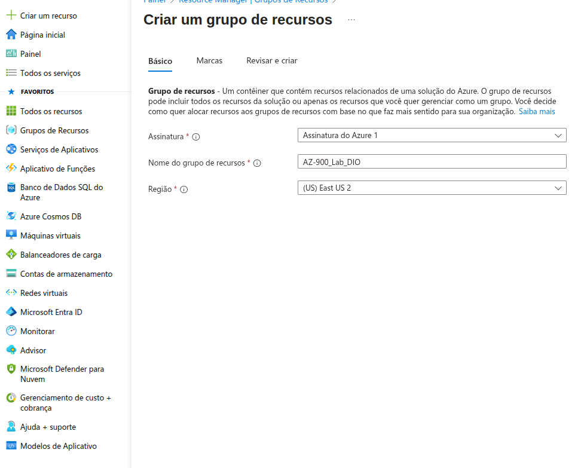
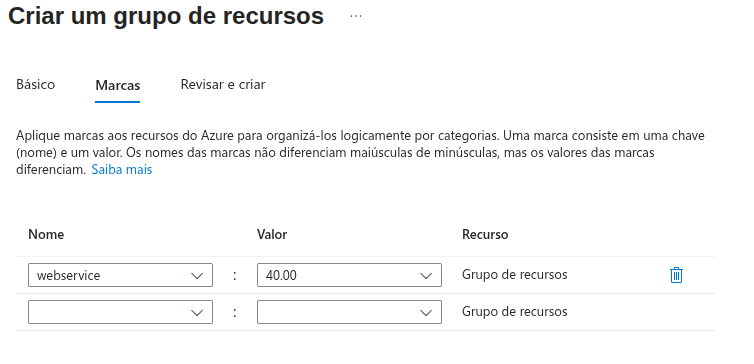
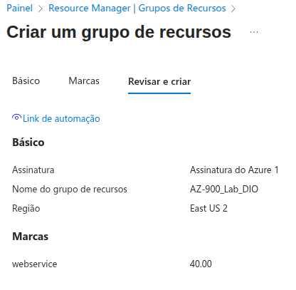
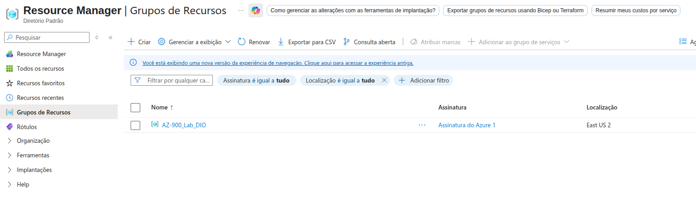
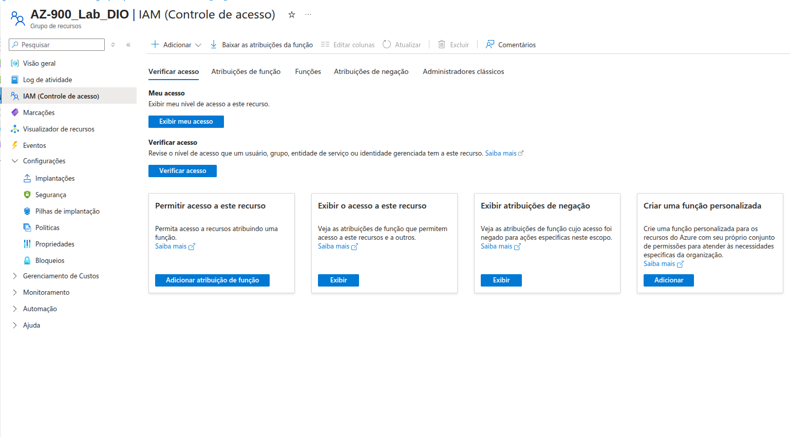
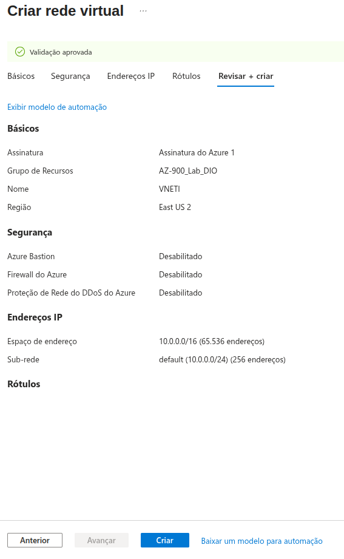
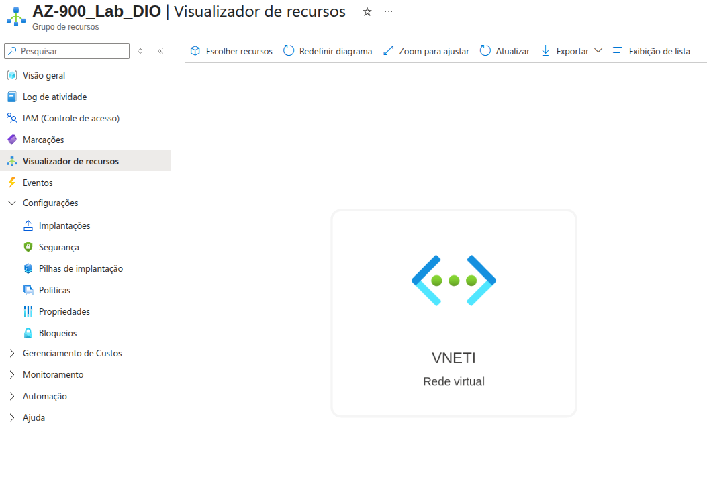

# Construindo Arquiteturas no Azure

## Neste desafio aprendi: 
- Sobre as regiões e zonas de disponibilidade. Também fiz um tour vitural por toda infraestrutora através do portal: https://datacenters.microsoft.com/
- O conceito de Grupo de Recursos e como criar passo a passo
### 1. Definimos o nome e a região onde será criado

---
### 2. Definimos uma marcaçãoi

---
### 3. Revisamos e criamos

---
### 4. Grupo de Recurso criado

---
### 5. Explorando controle de acesso

---
### 6. Criei uma rede virtual

